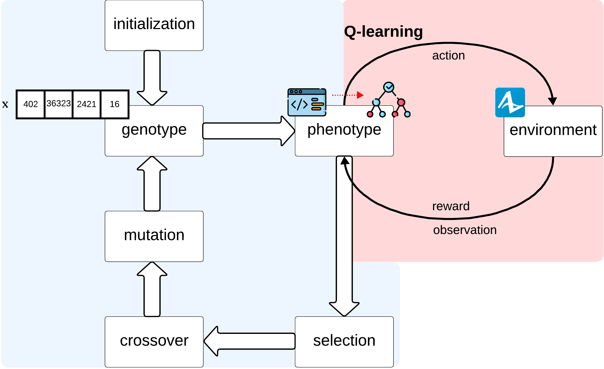

# Evolutionary Reinforcement Learning for Interpretable Decision Making for the Supply Chain
In the context of Industry 4.0, Supply Chain Management (SCM) faces challenges in adopting advanced optimization techniques due to the "black-box" nature of AI-based solvers 🤖. This complexity often leads to reluctance among company stakeholders. In response, this study employs an Interpretable Artificial Intelligence (IAI) approach called **ELDT**, which combines evolutionary computation with reinforcement learning to create interpretable decision-making policies in the form of decision trees (DT) 🌳.

This interpretable solver is integrated into a simulation-based optimization framework specifically designed to manage the inherent uncertainties and stochastic behaviors of modern supply chains 🔄. To our knowledge, this represents the first attempt to combine IAI solvers with simulation-based optimization for SCM decision-making.

The methodology has been tested on two supply chain optimization problems: one fictional (make-or-buy) and one from the real world (Hybrid Flow Shop Scheduling, or HFS) ⚙️. Its performance has been compared against widely used algorithms. The results indicate that the interpretable approach not only delivers competitive performance but, in some cases, even outperforms traditional methods 📈. This challenges the common belief that there is a trade-off between interpretability and optimization efficiency.

Furthermore, the developed framework shows strong potential for use in industry, offering seamless integration with various Python-based solvers 🐍.

<p align="center">

</p>

---

## Requirements
Before getting started, make sure you have installed all the requirements.
```
pip install -r requirements.txt
```

---

## Algorithms
The optimization algorithms we implemented are divided into two categories based on how they handle the input list of customer orders. **Schedule-as-a-whole approaches** consider the entire list of orders collectively. In contrast, **policy-generating approaches** concentrate on training a policy that processes each order individually, making decisions based on the specific features of that order.
### schedule-as-a-whole approaches
#### random search (RS)
For the **make-or-buy** decision problem, the **RS** baseline generates a random binary vector **x** of length $N$, representing decisions for a list of $N$ orders. This vector is evaluated using an AnyLogic simulation to calculate the total revenue $R$. Over `n_iterations`, the algorithm tracks and updates the highest-revenue solution.

For the **HFS** task, the **RS** baseline generates random job permutations and evaluates each over `n_iterations`, tracking the best-performing solution based on the revenue achieved.

##### make-or-buy
```
python optimization_random_search.py --n_iterations <n_iterations> --out_dir <output_directory> --no_runs <no_runs>
```
> ⚠️ **Note:** For the **make-or-buy** decision problem, the list of orders is provided in an Excel document. Please ensure that the "population_orders" in the AnyLogic model is correctly referencing the appropriate Excel file.
##### hfs
```
python optimization_random_search.py --n_iterations <n_iterations> --out_dir <output_directory> --no_runs <no_runs> --m <M> --e <E> --r <R> --dataset <dataset_path>
```
#### greedy heuristic (GREEDY)
For the **HFS** problem we include in our experimental evaluation a simple deterministic greedy heuristic, which prioritizes jobs based on their due dates. Specifically, jobs with the earliest due dates are given the highest priority.
##### hfs
```
python optimization_heuristic.py --out_dir <output_directory> --m <M> --e <E> --r <R> --dataset <dataset_path>
```
#### optuna (OPTUNA)
[Optuna](https://optuna.org/) is an [open-source](https://github.com/optuna/optuna.git) optimizer that employs state-of-the-art algorithms for solving optimization problems. It includes a sampler, which generates trial configurations to explore promising solution regions, and a pruner, which stops unpromising trials. By default, Optuna uses the Tree-structured Parzen Estimator for sampling and the Median Pruner for early stopping.

In the **make-or-buy** decision problem, **OPTUNA** generates a binary vector **x** of length $N$ orders during each trial, and the algorithm is executed for `n_trials` trials.

In the **HFS** task, **OPTUNA** is executed for `n_trials` trials, where each iteration assigns a priority value between $0$ and $N$ to each job in the input, with $N$ representing the total number of laser cutting machine orders to be scheduled.
##### make-or-buy
```
python optimization_optuna.py --n_trials <n_trials> --out_dir <output_directory> --no_runs <no_runs>
```
> ⚠️ **Note:** For the **make-or-buy** decision problem, the list of orders is provided in an Excel document. Please ensure that the "population_orders" in the AnyLogic model is correctly referencing the appropriate Excel file.
##### hfs
```
python optimization_optuna.py --n_trials <n_trials> --out_dir <output_directory> --no_runs <no_runs> --m <M> --e <E> --r <R> --dataset <dataset_path>
```
#### genetic algorithm (GA)
We developed **GA** using the structure provided by the [open-source inspyred Python library](https://github.com/aarongarrett/inspyred.git).

For the **make-or-buy** task, each individual candidate solution, denoted as **x**, is represented by a fixed-length binary genotype, where the length corresponds to the total number of orders. Each gene in **x** encodes a decision for a specific order: either "make" (0) or "buy" (1). The fitness of an individual is determined by the revenue $R$ obtained through the AnyLogic simulation, which evaluates the sequence of make-or-buy decisions encoded in the genotype. Initially, the population is composed by `ga_psize` randomly generated individuals. Following the default setting of inspyred, our **GA** employs rank selection, one-point crossover, bit-flip mutation. Rank selection indicates that individuals are ranked based on their fitness and higher-ranked individuals have a higher chance of being selected for reproduction. One-point crossover is a popular crossover technique. Given two parent individuals, a single crossover point is randomly chosen along the length of the chromosome, and the offspring inherit the genetic material from one parent up to that point and from the other parent after it. The operator is applied with a probability denoted by `ga_cp`. Bit-flip mutation is a mutation operator where the chromosomes are randomly flipped from 0 to 1 or from 1 to 0. Each bit is mutated with probability `ga_mp`. Evolution follows the generational replacement with elitism approach, where the top `ga_elities` individuals, meaning those with the highest fitness, are preserved across generations. The remaining population is replaced with new offspring generated through selection, crossover, and mutation, ensuring the introduction of novel genetic material in each generation and guiding the algorithm towards convergence. The evolutionary process is controlled by a computational budget defined as a maximum number of generations, `ga_gen`.

In line with current trends in HFS research, we also include a **GA** implementation for the **HFS** problem. The population consists of `ga_psize` individuals, where each candidate solution is a list of input jobs arranged in descending priority order. The fitness of each individual is determined by the makespan achieved at the end of the AnyLogic simulation based on the proposed job sequence. The evolutionary algorithm runs for `ga_gen` generations. Rank selection is used to choose parent individuals for crossover, meaning individuals are selected based on their rank in the population, with higher-ranked individuals having a greater chance of being selected. Generational replacement with elitism is employed at each generation, where the entire population is replaced by new offspring, except for the best `ga_elites` individuals, who are preserved to ensure high-quality solutions carry over to the next generation. Mutation and crossover are applied with probabilities `ga_mp` and `ga_cp`, respectively. Since individuals represent a permutation of the input jobs, both evolutionary operators must avoid introducing duplicates in the genotype of the newly generated offspring. The mutation operator randomly swaps genes in an individual a specified number of times, `ga_mn`. For crossover, we use the order crossover (OX) method [originally proposed by Davis](https://citeseerx.ist.psu.edu/document?repid=rep1&type=pdf&doi=4f1330b9b790d0adfe80c82c8b2ff27e6cdbf715). The operation of the OX operator can be illustrated using an example from Zbigniew Michalewicz’s book ["Genetic Algorithms + Data Structures = Evolution Programs"](https://books.google.com/books?hl=it&lr=&id=JmyrCAAAQBAJ&oi=fnd&pg=PA1&dq=Genetic+algorithms%2B+data+structures%3D+evolution+programs&ots=YrJPBU9kvs&sig=sfQTKyBiFZggleopODtDV2Zd9qw).\
Given two parent solutions, `p₁` and `p₂`, with two randomly selected cut points marked by '|':\
`p₁` = (1 2 3 | 4 5 6 7 | 8 9)  
`p₂` = (4 5 2 | 1 8 7 6 | 9 3) 

First, the segments between the cut points are copied directly into the offspring:

`o₁` = (x x x | 4 5 6 7 | x x)  
`o₂` = (x x x | 1 8 7 6 | x x)  

Next, starting from the second cut point of one parent, the genes from the other parent are copied in the same order, skipping any genes already present in the offspring. Once the end of the string is reached, the procedure continues from the first place of the list. The final offspring are:

`o₁` = (2 1 8 | 4 5 6 7 | 9 3)  
`o₂` = (3 4 5 | 1 8 7 6 | 9 2)  

This method effectively transfers information about the relative order of jobs from parents to offspring, emphasizing the importance of job sequencing in the resulting solutions.
##### make-or-buy
```
python optimization_ga.py --out_dir <output_directory> --no_runs <no_runs> --population_size <ga_psize> --offspring_size <ga_psize> --max_generations <ga_gen>
```
> ⚠️ **Note:** For the **make-or-buy** decision problem, the list of orders is provided in an Excel document. Please ensure that the "population_orders" in the AnyLogic model is correctly referencing the appropriate Excel file.
##### hfs
```
python optimization_ga.py --out_dir <output_directory> --no_runs <no_runs> --m <M> --e <E> --r <R> --dataset <dataset_path> --max_generations <ga_gen> --population_size <ga_psize> --offspring_size <ga_psize>
```
#### ant colony optimization (ACO)
To develop our optimization algorithm **ACO**, we adopt the implementation structure provided by the inspyred Python library. In the inspyred framework, a swarm of `aco_psize` artificial ants constructs potential solutions by iteratively selecting components from a set of trial components $\mathcal{C}$. Each trial component $c \in \mathcal{C}$ is associated with a desirability score $d(c)$, which is computed as a combination of the pheromone level $\tau$ and a problem-dependent heuristic value $\eta$.

$d(c) = \tau_c^\delta + \eta_c^\epsilon$

At each step, each ant $k$ of the population samples a random number $q \in [0,1]$. If $q$ is smaller than a threshold `q_0`, the ant chooses the edge $(i,j)$ with the highest desirability, otherwise, if $q \geq$ `q_0`, a probabilistic transition rule is used:

$p_{c}^k(t) \frac{[\tau_{c}(t)]^\delta \cdot [\eta_{c}]^\epsilon}{\sum_{l \in N_i^k} [\tau_{c}(t)]^\delta \cdot [\eta_{c}]^\epsilon} \quad \text{if } c \in N_i^k$

In the equation, the probability that ant $k$ chooses trial component $c$ at step $i$ (where $c$ belongs to the set of trial components $N_i^k \subseteq \mathcal{C}$ accessible by ant $k$ at step $i$) is proportional to the pheromone level $\tau$ and heuristic value $\eta$ of the trial component $c$, relative to all other available components. Once all ants have completed their paths, the pheromone levels of the trial components evaporate according to the evaporation rate parameter $\rho$.

$\tau_{c}(t+1) = (1-\rho) \cdot \tau_{ij}(t) + \rho \cdot \tau_{ij}(0)$

Finally, the pheromone levels on the components comprising the best solution path $p$ are reinforced based on the path's fitness $f(p)$ and a learning rate parameter $\alpha$.

$\tau_{c}(t+1) = (1-\alpha) \cdot \tau_{c}(t) + \alpha \cdot f(p) \quad \text{for each } c \in p$

These updates modify the environment, guiding the evolution of subsequent ant generations.

We found that in the case of the **make-or-buy** decision problem, incorporating problem-specific heuristic information is not necessary for achieving good results, so we set $\eta=1$ for all trial components. The set of trial components $\mathcal{C}$ consists of $2 \times N$ elements (where $N$ denotes the total number of orders), represented as $\mathcal{C} = \lbrace o_1, o_2, . . ., o_N, -o_1, -o_2, . . ., -o_N \rbrace$. Selecting $o_i$ corresponds to outsourcing order $i$, while selecting $-o_i$ means handling order $i$ internally. During the solution construction process, an ant can choose, following a probabilistic transition rule, only from components $o_i$ such that neither $o_i$ nor $-o_i$ has already been included in the partial solution. The fitness of the solution path, composed of the selected trial components, is determined by the total revenue $R$ generated from the AnyLogic simulation. This fitness value guides the pheromone update process of the trial components. The evolutionary process continues for a maximum number of generations, denoted by `aco_gen`.

The authors of [[paper](https://link.springer.com/article/10.1007/s00170-007-1048-2)] were the first to apply ant colony optimization to solve the **HFS** problem. Their experiments used benchmarks with a small number of jobs, suggesting that limiting the number of input jobs is necessary to avoid excessive execution times. Initially, in our implementation we defined the discrete set of trial components as $\mathcal{C} = \lbrace (0, j_0),(0, j_1),...,(n−1, j_{n−1}) \rbrace$, where $j_0, j_1, . . ., j_{n−1}$ represent the jobs, and $n$ is the total number of jobs. In this configuration, an ant would construct a solution by selecting components, where choosing component $(i, j_k)$ means that job $j_k$ is placed in the $i$-th position of the schedule. At each step, an ant can only select components that lead to jobs not yet included in the schedule, ensuring that each job appears only once. The fitness of an ant’s path, representing a schedule, is evaluated by the makespan obtained from an AnyLogic simulation following the proposed job order. This approach resulted in excessive execution times for problem instances with a number of jobs $n$ an order of magnitude larger than those considered in [[paper](https://link.springer.com/article/10.1007/s00170-007-1048-2)]. In order to overcome this issue, we revised the ant colony optimization implementation by reducing the set of trial components, thereby decreasing the computational complexity. In our modified approach (**ACO**), the set of trial components is simplified to $\mathcal{C} = \lbrace j_0, . . ., j_n \rbrace$. Each ant constructs a job schedule by sequentially selecting jobs that have not yet been included in the schedule. The limitation of this method is that the position of jobs in the final schedule is not directly considered when updating pheromone levels. To mitigate this, we modified the pheromone update rule to account for the position of each job in the schedule. Only the pheromone levels of the trial components in the best solution are updated. Since in this case all components in $\mathcal{C}$ are part of the best solution (which is a permutation of $\mathcal{C}$), the pheromone level $\tau_{j_i}$ for component $j_i$ is updated as follows:

$$\tau_{ij}(t+1) = (1 − \alpha) \cdot \tau_{ij}(t) + \alpha \cdot f(p) \cdot (n − pos(j_i,p))$$

where $p$ is the best solution path (i.e., the schedule of jobs resulting in the smallest makespan), $|p| = |\mathcal{C}| = n$, and $\text{pos}(j_i, p)$ is the position of job $j_i$ in the schedule $p$. This approach gives higher weight to jobs placed earlier in the schedule. By default, the ant colony optimization implementation in the inspyred Python library is designed for maximization problems. Since we aim to minimize the makespan, the fitness of a solution constructed by an ant, denoted as $f(p)$, is defined as the reciprocal of the makespan obtained from the AnyLogic simulation based on the proposed schedule. This can be expressed as: $f(p) = \frac{1}{\text{makespan}}$. In this way, lower makespan values will result in higher fitness scores, aligning the problem with the library’s maximization framework. The heuristic value $\eta_{j_i}$, associated with each trail component $j_i$ is defined as $\frac{1}{\text{delivery}(j_i)}$, where $\text{delivery}(j_i)$ is the due date of job $j_i$. The optimal job configuration is searched by a population of `aco_psize` ants that evolve over `aco_gen` generations.
##### make-or-buy
```
python optimization_aco.py --out_dir <output_directory> --no_runs <no_runs> --population_size <aco_psize> --max_generations <aco_gen>
```
> ⚠️ **Note:** For the **make-or-buy** decision problem, the list of orders is provided in an Excel document. Please ensure that the "population_orders" in the AnyLogic model is correctly referencing the appropriate Excel file.
##### hfs
```
python optimization_aco.py --out_dir <output_directory> --dataset <dataset_path> --no_runs <no_runs> --m <M> --e <E> --r <R> --max_generations <aco_gen> --population_size <aco_psize>
```
### policy-generating approaches
#### reinforcement learning (RL)
For our **RL** approach, we utilize the [PPO implementation from RLlib](https://docs.ray.io/en/latest/rllib/index.html), an open-source library designed for reinforcement learning applications. The training environment, where the reinforcement learning agent learns its policy, is built using the [OpenAI Gymnasium Python library](https://gymnasium.farama.org/).

As regards the **make-or-buy** decision task, the specific environment to be solved is a list of orders, and the policy the agent aims to learn is a deep neural network that decides for each order whether to outsource it or produce it in-house. Since the agent processes one order at a time, the observation space is a 5-dimensional vector encoding the input order. The first entry is the order's unique identifier, the second is the number of components of type A required, the third is the number of components of type B, the fourth is the number of components of type C, and the fifth is the order's deadline timestamp. The action space consists of two discrete options: 0 indicates the decision to produce the order internally, while 1 represents the decision to outsource the order to an external supplier. A key aspect of the training process is the use of delayed rewards. The agent receives no immediate feedback after processing each order; a zero reward is given until the entire list of orders has been processed. After the agent has made a "make-or-buy" decision (0 or 1) for each order, the final reward is determined by the total revenue obtained, as calculated through the AnyLogic simulation. An alternative approach could involve providing intermediate rewards by running multiple AnyLogic simulations after a set number of processed orders. Notably, this would significantly slow down the training due to the increased computational cost. Therefore, despite the challenges that are usually associated with delayed rewards, such as potential training instability, we do not adopt this alternative to avoid the excessive execution time and implementation overhead that it would introduce. During training, we count the number of AnyLogic simulations executed and terminate the process after a predefined number `rl_eval` of AnyLogic evaluations.

For the **HFS**, the task assigned to the reinforcement learning agent involves optimizing the scheduling of the list of laser cutting machine orders $j_0, ..., j_n$. The goal is to assign appropriate priorities to these orders to create a schedule that minimizes the makespan. The observation space, which serves as the input to the deep neural network, processes one order $j_i$ at a time. Each order is encoded as a one-dimensional vector with the following components: an integer representing the machine type, the date of basement arrival, the date of electrical panel arrival, the due date, and the number of jobs yet to be processed. The action space, corresponding to the neural network's output, is a value between $0$ and $n$, representing the priority assigned by the policy to the given job. During environment exploration, the agent receives delayed rewards, meaning the reward is always zero until a priority value has been assigned to all jobs. Once all jobs are prioritized, the reward is calculated by simulating the agent's proposed schedule in AnyLogic. The simulation output is the makespan of the schedule. Since the PPO implementation in RLlib is designed to maximize rewards, and our objective is to minimize the makespan, we reformulate the problem into a maximization problem. To do this without resorting to negative rewards (which can introduce various complications), we estimate an upper bound for the makespan, $\text{makespan}\_{\text{max}}$, based on the input list of jobs. The reward to be maximized is then defined as $\text{makespan}\_\text{max} - \text{makespan}$, where $\text{makespan}$ is the output from AnyLogic. The agent explores the environment using this procedure for a predefined maximum number of AnyLogic simulations, denoted as `rl_eval`.
##### make-or-buy
```
python optimization_rl.py --out_dir <output_directory> --no_runs <no_runs> --no_evaluations <rl_eval>
```
> ⚠️ **Note:** For the **make-or-buy** decision problem, the list of orders is provided in an Excel document. Please ensure that the "population_orders" in the AnyLogic model is correctly referencing the appropriate Excel file.

> ⚠️ **Note:** In the RL implementation for solving the **make-or-buy** decision problem, the line ```df = pd.read_excel("orders.xlsx")``` has to be modified to reference the specific Excel file containing the input orders.
##### hfs
```
python optimization_rl.py --out_dir <output_directory> --no_runs <no_runs> --no_evaluations <rl_eval> --m <M> --e <E> --r <R> --num_machine_types <num_machine_types> --max_makespan <max_makespan> --dataset <dataset_path>
```
> ⚠️ **Note:** To properly determine the value of $\text{makespan}\_{\text{max}}$ for a given problem instance, we recommend executing the optimization process using another optimizer. This will provide insight into the makespan values obtained, allowing you to set the $\text{makespan}\_{\text{max}}$ argument accordingly. For the datasets used in this paper, we established the following $\text{makespan}\_{\text{max}}$ values: $\text{makespan}\_{\text{max}} = 500$ for datasets d1, d2, and d3; $\text{makespan}\_{\text{max}} = 650$ for dataset d4; and $\text{makespan}\_{\text{max}} = 2500$ for dataset d5.

> ⚠️ **Note:** As previously explained, machine types are represented by integer values. However, in the dataset files, these machine types are indicated using strings. Before running the code, it is crucial to update the dictionary `self.machine_type_encoding: Dict[str, int]` in the `AdigeEnv(gym.Env)` environment to accurately reflect the mapping between machine types and their corresponding integer values.
#### genetic programming (GP)
To implement **GP**, we use the open-source Python library [deap](https://github.com/DEAP/deap.git).

For the **make-or-buy** decision problem, the goal of the evolutionary algorithm is to evolve a population of `gp_psize` decision trees that take an order as input and return a binary decision: whether to "make" or "buy" the order. Each order is represented by three integers, corresponding to the number of components of type A, B, and C required for processing. We intentionally exclude the order's deadline from the input features to reduce the solution space, thereby simplifying training, speeding up execution times, and discouraging the generation of complex tree structures that would be difficult to interpret and therefore less useful. The fitness of a decision tree is determined by the revenue generated in the AnyLogic simulation, based on the "make-or-buy" decisions made by the tree. The evolutionary algorithm aims to guide the population toward high-fitness solutions. We define a strongly typed grammar, where each function and terminal has a specified type. The output type of a function must match the input type of another function for them to be connected. The function set $F$ is defined as follows:\
&nbsp;&nbsp;&nbsp;&nbsp;&nbsp;&nbsp;**$F$**:\
&nbsp;&nbsp;&nbsp;&nbsp;&nbsp;&nbsp;**and**(a, b): 𝔹 × 𝔹 → 𝔹\
&nbsp;&nbsp;&nbsp;&nbsp;&nbsp;&nbsp;**or**(a, b): 𝔹 × 𝔹 → 𝔹\
&nbsp;&nbsp;&nbsp;&nbsp;&nbsp;&nbsp;**not**(a): 𝔹 → 𝔹\
&nbsp;&nbsp;&nbsp;&nbsp;&nbsp;&nbsp;**lt**(x, y): ℤ × ℤ → 𝔹\
&nbsp;&nbsp;&nbsp;&nbsp;&nbsp;&nbsp;**gt**(x, y): ℤ × ℤ → 𝔹\
&nbsp;&nbsp;&nbsp;&nbsp;&nbsp;&nbsp;**if_then_else**(c, x, y): 𝔹 × 𝕊 × 𝕊 → 𝕊

Where 𝔹 represents boolean values (True/False), ℤ denotes integers, and 𝕊 refers to strings.

The terminal set $T$ is defined as:\
&nbsp;&nbsp;&nbsp;&nbsp;&nbsp;&nbsp;**$T$**:\
&nbsp;&nbsp;&nbsp;&nbsp;&nbsp;&nbsp; $n \in \lbrace 1, 2, ..., 20 \rbrace$, $n \in ℤ$\
&nbsp;&nbsp;&nbsp;&nbsp;&nbsp;&nbsp;"outsource" ∈ 𝕊\
&nbsp;&nbsp;&nbsp;&nbsp;&nbsp;&nbsp;"not_outsource" ∈ 𝕊\
&nbsp;&nbsp;&nbsp;&nbsp;&nbsp;&nbsp;False ∈ 𝔹\
&nbsp;&nbsp;&nbsp;&nbsp;&nbsp;&nbsp;True ∈ 𝔹

The constant integer values are restricted to the interval $[1, 20]$, as the maximum number of components of type A, B, and C required to fulfill an order is 20. Using this grammar, an initial population of `gp_psize` individuals is randomly generated using the `genHalfAndHalf` method. Half of the population is created using the `genGrow` method, where tree depths vary between `gp_minT` and `gp_maxT`. The other half is generated using `getFull`, where all trees have a fixed depth between `gp_minT` and `gp_maxT`. For mutation, we employ a uniform mutation operator. In this approach, a random point in a tree is replaced by a new subtree generated using the `genHalfAndHalf` method, parameterized by a minimum depth of `gp_minM` and a maximum depth of `gp_maxM`. For crossover, we use one-point crossover, where randomly selected subtrees from two parent individuals are swapped. The mutation and crossover operators are applied with probabilities `gp_mp` and `gp_cp`, respectively. We use tournament selection with tournament size `gp_tsize` to choose the individuals for mating. The evolutionary process terminates after a maximum of `gp_gen` generations.

In the case of the **HFS** problem, **GP** evolves a population of `gp_psize` decision trees that take a laser cutting machine encoded as a 1-D vector of features and return a priority level from 0 to `priority_levels`. The range $[0,n]$ (with $n$ as the input cardinality) is divided into equal consecutive intervals corresponding to these priority levels. When a priority level is assigned by a leaf node, the actual priority is chosen randomly within the associated interval. Each input laser cutting machine is represented by four integers features: machine type (**mt**), date basement arrival (**db**), date electrical panel arrival (**de**), and delivery date (**dd**). The fitness of a decision tree is determined by the makespan (to be minimized) obtained through the AnyLogic simulation, based on the job schedule determined by the tree. A strongly typed grammar is used, with function set $F$ defined as follows:

&nbsp;&nbsp;&nbsp;&nbsp;&nbsp;&nbsp;**$F$**:\
&nbsp;&nbsp;&nbsp;&nbsp;&nbsp;&nbsp;**eq**(x, y): {**mt**} × {**mt**} → 𝔹\
&nbsp;&nbsp;&nbsp;&nbsp;&nbsp;&nbsp;**lt**(x, y): {**db**, **de**, **dd**} × {**db**, **de**, **dd**} → 𝔹\
&nbsp;&nbsp;&nbsp;&nbsp;&nbsp;&nbsp;**gt**(x, y): {**db**, **de**, **dd**} × {**db**, **de**, **dd**} → 𝔹\
&nbsp;&nbsp;&nbsp;&nbsp;&nbsp;&nbsp;**if_then_else**(c, x, y): 𝔹 × 𝕊 × 𝕊 → 𝕊

The terminal set $T$ is defined as:

&nbsp;&nbsp;&nbsp;&nbsp;&nbsp;&nbsp;**$T$**:\
&nbsp;&nbsp;&nbsp;&nbsp;&nbsp;&nbsp; $n_1 \in \lbrace 1, 2, ..., \text{number of machine types in the dataset} \rbrace$\
&nbsp;&nbsp;&nbsp;&nbsp;&nbsp;&nbsp; $n_1 \in \lbrace 1, 2, ..., \text{latest basement arrival date in the dataset} \rbrace$\
&nbsp;&nbsp;&nbsp;&nbsp;&nbsp;&nbsp; $n_1 \in \lbrace 1, 2, ..., \text{latest electrical panel arrival date in the dataset} \rbrace$\
&nbsp;&nbsp;&nbsp;&nbsp;&nbsp;&nbsp; $n_1 \in \lbrace 1, 2, ..., \text{latest due date in the dataset} \rbrace$\
&nbsp;&nbsp;&nbsp;&nbsp;&nbsp;&nbsp; $n_1 \in \lbrace 1, 2, ..., \text{number of output priority levels} \rbrace$\
&nbsp;&nbsp;&nbsp;&nbsp;&nbsp;&nbsp;False ∈ 𝔹\
&nbsp;&nbsp;&nbsp;&nbsp;&nbsp;&nbsp;True ∈ 𝔹

$n_1, n_2, n_3, n_4, n_5$ represent bounded ephemeral constants, where $n_1$ encodes the laser cutting machine type as an integer between 1 and the total number of machine types, $n_2$ represents the basement arrival date ranging from 1 to the latest basement arrival date in the dataset, $n_3$ indicates the electrical panel arrival date between 1 and the latest electrical panel arrival date, $n_4$ corresponds to the due date from 1 to the latest due date, and $n_5$ specifies the output priority level between 0 and `priority_levels`.
The **GP** approach begins with a randomly generated initial population of `gp_psize` individuals using the genHalfAndHalf method. Uniform mutation and one-point crossover operators are applied, with tournament selection of size `gp_tsize` used to select individuals for mating. The evolutionary process terminates after a maximum of `gp_gen` generations.

##### make-or-buy
```
python optimization_gp.py --out_dir <output_directory> --no_runs <no_runs> --population_size <gp_psize> --max_generations <gp_gen>
```
> ⚠️ **Note:** For the **make-or-buy** decision problem, the list of orders is provided in an Excel document. Please ensure that the "population_orders" in the AnyLogic model is correctly referencing the appropriate Excel file.

> ⚠️ **Note:** In the GP implementation for solving the **make-or-buy** decision problem, the line ```df = pd.read_excel("orders.xlsx")``` has to be modified to reference the specific Excel file containing the input orders. 
##### hfs
```
python optimization_gp.py --out_dir <output_directory> --no_runs <no_runs> --m <M> --e <E> --r <R> --num_machine_types <num_machine_types> --priority_levels <priority_levels> --dataset <dataset_path> --population_size <gp_psize> --max_generations <gp_gen>
```
#### evolutionary learning decision trees (ELDT)
The outer loop of the optimization process in **ELDT** is an evolutionary algorithm, which evolves a population of `p_size` individuals. Each individual is encoded as a fixed-length list of integers. To evaluate an individual, it is first translated into a corresponding decision tree, based on the production rules of a problem-specific BNF grammar. The grammar implemented for the **make-or-buy** decision task is as follows.

&nbsp;&nbsp;&nbsp;&nbsp;&nbsp;&nbsp;⟨bt⟩ ::= ⟨if⟩\
&nbsp;&nbsp;&nbsp;&nbsp;&nbsp;&nbsp;⟨if⟩ ::= if ⟨condition⟩ then ⟨a⟩ else ⟨a⟩\
&nbsp;&nbsp;&nbsp;&nbsp;&nbsp;&nbsp;⟨a⟩ ::= leaf | ⟨if⟩\
&nbsp;&nbsp;&nbsp;&nbsp;&nbsp;&nbsp;⟨condition⟩ ::= ⟨in₀⟩ ⟨comp⟩ ⟨c⟩ | ⟨in₁⟩ ⟨comp⟩ ⟨c⟩ | ⟨in₂⟩ ⟨comp⟩ ⟨c⟩\
&nbsp;&nbsp;&nbsp;&nbsp;&nbsp;&nbsp;⟨comp⟩ ::= < | >\
&nbsp;&nbsp;&nbsp;&nbsp;&nbsp;&nbsp;⟨c⟩ ::= v ∈ [0, 21]

In this grammar, **\<bt\>** represents the starting symbol. The **\<if\>** rule is used to generate if-then-else statements. The outcome of an if-then-else statement, denoted by **\<a\>**, can either be a terminal **leaf** or another **\<if\>** statement. Within each **\<if\>** statement, the **\<condition\>** is expressed as an inequality comparison (**\<comp\>**) between the input variables **⟨in₀⟩**, **⟨in₁⟩**, or **⟨in₂⟩**, which represent the number of components of types A, B, or C required to process the input order, and a constant **⟨c⟩**, an integer in the range [1, 21]. At the terminal leaves of the decision tree, the agent must decide between two possible actions ($n\_\text{action}=2$), either to make or to buy the input order. The content of each leaf encodes the probability of making or buying the order and is updated using Q-learning. In particular, each generated decision tree guides the behavior of a reinforcement learning agent, which interacts with the environment over `n_episodes` episodes. Similar to **RL** and **GP**, the environment is the list of orders enumerated in the Excel document. The agent perceives and processes these orders one at a time.

In the case of the **HFS** problem, the production rules are defined as follows:

&nbsp;&nbsp;&nbsp;&nbsp;&nbsp;&nbsp;⟨bt⟩ ::= ⟨if⟩\
&nbsp;&nbsp;&nbsp;&nbsp;&nbsp;&nbsp;⟨if⟩ ::= if ⟨condition⟩ then ⟨a⟩ else ⟨a⟩ | if ⟨conditioneq⟩ then ⟨a⟩ else ⟨a⟩\
&nbsp;&nbsp;&nbsp;&nbsp;&nbsp;&nbsp;⟨a⟩ ::= leaf | ⟨if⟩\
&nbsp;&nbsp;&nbsp;&nbsp;&nbsp;&nbsp;⟨condition⟩ ::= ⟨in₁⟩ ⟨comp⟩ ⟨c₁⟩ | ⟨in₂⟩ ⟨comp⟩ ⟨c₂⟩ | ⟨in₃⟩ ⟨comp⟩ ⟨c₃⟩ | ⟨in₄⟩ ⟨comp⟩ ⟨c₄⟩\
&nbsp;&nbsp;&nbsp;&nbsp;&nbsp;&nbsp;⟨conditioneq⟩ ::= ⟨in₀⟩ = ⟨c₀⟩\
&nbsp;&nbsp;&nbsp;&nbsp;&nbsp;&nbsp;⟨comp⟩ ::= < | >\
&nbsp;&nbsp;&nbsp;&nbsp;&nbsp;&nbsp;⟨c₀⟩ ::= v ∈ [0, num_machine_types]\
&nbsp;&nbsp;&nbsp;&nbsp;&nbsp;&nbsp;⟨c₁⟩ ::= v ∈ [0, date_basement_arrival_max]\
&nbsp;&nbsp;&nbsp;&nbsp;&nbsp;&nbsp;⟨c₂⟩ ::= v ∈ [0, date_electrical_panel_arrival_max]\
&nbsp;&nbsp;&nbsp;&nbsp;&nbsp;&nbsp;⟨c₃⟩ ::= v ∈ [0, date_delivery_max]\
&nbsp;&nbsp;&nbsp;&nbsp;&nbsp;&nbsp;⟨c₄⟩ ::= v ∈ [0, n]

In this grammar, **⟨bt⟩** is the starting symbol. **⟨if⟩** statements are used to produce conditional logic, where the outcome, denoted by **⟨a⟩**, can either be a terminal leaf or another **⟨if⟩** statement, allowing for recursive branching within the tree. The condition production generates inequalities (**⟨comp⟩**) between constant integer values of types **⟨c₁⟩**,...,**⟨c₄⟩** and the input order features **⟨in₁⟩**, ..., **⟨in₄⟩**. The **⟨conditioneq⟩**, on the other hand, generates equalities between integer constants of type **⟨c₀⟩** and the input feature **⟨in₀⟩**. For a given input order $j_i$ at any point in the execution, the input features are defined as follows: **⟨in₀⟩** represents the machine type; **⟨in₁⟩** represents the basement arrival date; **⟨in₂⟩** represents the electrical panel arrival date; **⟨in₃⟩** represents the due date; **⟨in₄⟩** represents the number of remaining jobs that need to be prioritized. The **leaf** terminal symbol represents the insertion of a leaf node in the resulting decision tree. The decision trees produced by this grammar in the first optimization stage are employed in the second optimization stage. At this stage, the decision tree processes one laser cutting machine order $j\_i$ at a time (the observation space), makes decisions based on the order's features, and outputs a priority (the action space). The reward, $\text{makespan}\_\text{max} - \text{makespan}$, is provided by the environment once all jobs $j\_0, ..., j\_n$ have been prioritized. Notably, the leaf nodes in the decision tree do not directly assign a priority number. Instead, they produce a priority level, selected from a predefined set of `priority_levels` priority levels. The range $[0,n]$ is divided into equal consecutive intervals corresponding to these priority levels. When a priority level is produced by a leaf node, the actual priority assigned to the job is a random number uniformly selected from the interval associated with that priority level. Remarkably, this approach significantly reduces the action space, thus facilitating the convergence of Q-learning. At each generation, the decision trees in the population interact with the environment for `n_episodes` to update the content of the leaves using Q-learning. The environment in this problem is a list of jobs. To avoid evolving decision trees that overfit to the specific order in which jobs appear, the Gym environment is reset at each generation, and the list of input orders is randomly shuffled. This ensures that the evolved interpretable decision trees are capable of making decisions based on the intrinsic properties of the orders, rather than the order in which they are presented.
##### make-or-buy
```
python optimization_ge.py --out_dir <output_directory> --no_runs <no_runs> --population_size <p_size> --max_generations <ge_gen> --episodes <n_episodes>
```
> ⚠️ **Note:** For the **make-or-buy** decision problem, the list of orders is provided in an Excel document. Please ensure that the "population_orders" in the AnyLogic model is correctly referencing the appropriate Excel file.

> ⚠️ **Note:** In the ELDT implementation for solving the **make-or-buy** decision problem, the line ```df = pd.read_excel("orders.xlsx")``` has to be modified to reference the specific Excel file containing the input orders.
##### hfs
```
python optimization_ge.py --m <M> --e <E> --r <R> --num_machine_types <num_machine_types> --max_makespan <max_makespan> --max_generations <ge_gen> --dataset <dataset_path> --out_dir <output_directory> --no_runs <no_runs> --population_size <p_size> --episodes <n_episodes> --priority_levels <priority_levels>
```
> ⚠️ **Note:** To properly determine the value of $\text{makespan}\_{\text{max}}$ for a given problem instance, we recommend executing the optimization process using another optimizer. This will provide insight into the makespan values obtained, allowing you to set the $\text{makespan}\_{\text{max}}$ argument accordingly. For the datasets used in this paper, we established the following $\text{makespan}\_{\text{max}}$ values: $\text{makespan}\_{\text{max}} = 500$ for datasets d1, d2, and d3; $\text{makespan}\_{\text{max}} = 650$ for dataset d4; and $\text{makespan}\_{\text{max}} = 2500$ for dataset d5.

> ⚠️ **Note:** As previously explained, machine types are represented by integer values. However, in the dataset files, these machine types are indicated using strings. Before running the code, it is crucial to update the dictionary `self.machine_type_encoding: Dict[str, int]` in the `AdigeEnv(gym.Env)` environment to accurately reflect the mapping between machine types and their corresponding integer values.

---

## Hyperparameter setting
To ensure a fair comparison, each algorithm was allocated 5000 AnyLogic simulation executions. Hyperparameters affecting the computational budget were adjusted accordingly, while other parameters were set to their library defaults.

### schedule-as-a-whole approaches

#### RANDOM

| Parameter      | Value |
|----------------|-------|
| `n_iterations` | 5000  |

#### OPTUNA

| Parameter      | Value |
|----------------|-------|
| `n_trials`     | 5000  |

#### GA

| Parameter       | Value |
|-----------------|-------|
| `ga_psize`      | 10    |
| `ga_gen`        | 500   |
| `ga_mp`         | 1.0   |
| `ga_cp`         | 1.0   |
| `ga_mn`         | 1     |
| `ga_elites`     | 1     |

#### ACO

| Parameter       | Value |
|-----------------|-------|
| `aco_gen`       | 500   |
| `aco_psize`     | 10    |
| `q_0`           | 0.5   |
| `α`             | 0.1   |
| `δ`             | 1.0   |
| `ρ`             | 0.1   |

### policy-generating approaches

#### RL

| Parameter       | Value |
|-----------------|-------|
| `rl_eval`       | 5000 |

#### GP

| Parameter       | Value |
|-----------------|-------|
| `gp_gen`        | 250   |
| `gp_psize`      | 20    |
| `gp_mp`         | 0.2   |
| `gp_cp`         | 0.5   |
| `gp_tsize`      | 3     |
| `gp_minT`       | 2     |
| `gp_maxT`       | 5     |
| `gp_minM`       | 0     |
| `gp_maxM`       | 2     |
| `gp_hof_size`   | 1     |

#### ELDT

| Parameter       | Value  |
|-----------------|--------|
| `g_l`           | 100    |
| `g_max`         | 40000  |
| `p_size`        | 5      |
| `c_p`           | 0.5    |
| `m_p`           | 0.5    |
| `ge_gen`        | 200    |
| `t_size`        | 2      |
| `α`             | 0.001  |
| `γ`             | 0.05   |
| `ε`             | 0.05   |
| `n_episodes`    | 5      |

---

## Contributions
Authors:
- Stefano Genetti, MSc Student University of Trento (Italy), stefano.genetti@unitn.it
- Giovanni Iacca, Associate Professor University of Trento (Italy), giovanni.iacca@unitn.it

For every type of doubt/question about the repository please do not hesitate to contact us.
